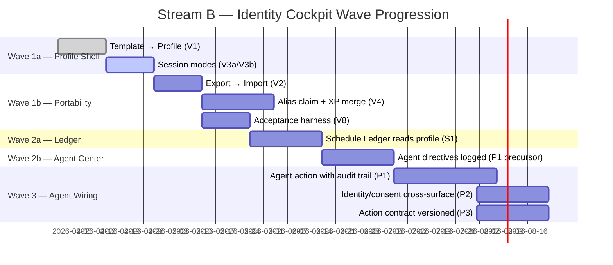
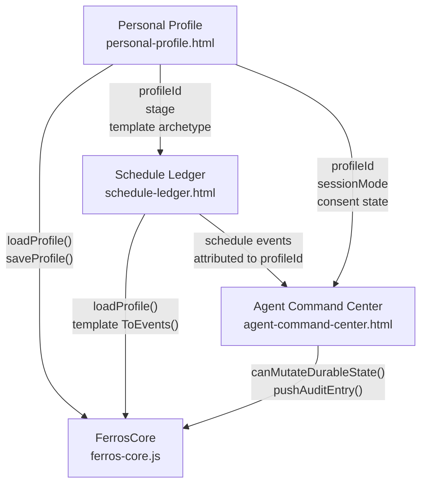

# Stream B — Identity Cockpit (Profile + Ledger + Agent Center)

> **Stream status:** Wave 1 active. Profile shell exists; Ledger and Agent Center are prototypes.
> **Philosophy:** The CEO's desk. Three surfaces, one cockpit, one person's complete operational layer.

---

## What This Stream Is

Stream B is the unified personal experience layer. It combines three surfaces that, while distinct in function, represent the complete picture of one person running the FERROS platform:

1. **Personal Profile** (`docs/personal-profile.html`) — Who you are. Your identity, your portable data token, your consent and progression record.
2. **Schedule Ledger** (`docs/schedule-ledger.html`) — What you're doing. Your calendar, your commitments, your tasks and meetings.
3. **Agent Command Center** (`docs/agent-command-center.html`) — Who you're directing. Your bots, your delegation layer, your full audit trail of agent actions.

These are not three separate apps. They are three facets of the CEO's cockpit. When you sit down at your FERROS desk, you see your identity, your schedule, and your agents — all in one place.

---

## Why These Three Are One Stream

Here is the design logic:

**Profile without Ledger** is an identity with no context. You know who you are but not what you're doing today.

**Ledger without Profile** is a calendar with no owner. Events have no attribution, no consent, no portability.

**Agent Center without Profile** is a command panel with no authorization model. Who gave this command? Were they permitted to give it?

When the three are unified, the cockpit becomes coherent: the Profile authenticates the identity, the Ledger frames the day, and the Agent Center delegates with full traceability back to that identity.

---

## CEO Persona Walkthrough

This walkthrough grounds the entire stream in a concrete user journey. We'll use **Alex**, the CEO of FERROS, making their first account.

### The Setup

Alex is sophisticated but busy. They want to know: What am I signing up for? Who owns this data? Can I leave and take my stuff with me? Can I delegate to bots without losing control?

FERROS answers all four questions before Alex completes onboarding.

---

### Step 1 — Profile Creation: Template → Profile

**Surface:** `docs/personal-profile.html`  
**Capability:** V1 — Template → Profile creation completes without soft-lock

1. Alex opens `docs/personal-profile.html` in Chrome via `file://`.
2. The genesis shell presents: **"Choose a starting template."** Options include archetypes that map to `docs/assets/_core/templates.json` — 12 templates available, each pre-validated against `schemas/template.schema.json`.
3. Alex selects **"CEO / Operator"** — a template that pre-populates role, time zone preferences, and a starter routine module.
4. The onboarding flow presents the **consent step**: what data will be stored, where (localStorage), what it means to export/import. Alex reads it; it's one paragraph, plain language.
5. Alex enters a display name: `Alex Ferros`.
6. The profile is generated: `FerrosCore.saveProfile()` writes the initial object to localStorage. The seal chain begins with a genesis hash via `FerrosCore.computeHash()`.
7. Alex sees their profile card: name, template archetype, stage 0, XP: 0. The cockpit is live.

**What just happened under the hood:**
```
Template: "ceo-operator" (from templates.json)
  → templateToProfile() creates minimal-stage0-profile shape
  → profile.schemaVersion = "2.0"
  → profile.stage = 0
  → profile.sessionMode = "full"
  → computeHash(genesis) → profile.sealChain[0]
  → saveProfile() → localStorage["ferros_profile"]
```

**Contract touched:** C2 (Profile Schema), C3 (Template Schema), C9 (Storage Rules)

---

### Step 2 — First Schedule Entry

**Surface:** `docs/schedule-ledger.html`  
**Capability:** S1 (precursor) — Schedule Ledger reads profile data

1. Alex navigates to the Schedule Ledger. It reads their profile from localStorage: `FerrosCore.loadProfile()`.
2. Alex sees an empty calendar. The Ledger knows it's Alex because the profile is loaded.
3. Alex creates a **meeting**: "Investor call — Thursday 2pm — 45 min". This maps to a schedule event object conforming to `schemas/schedule-event.schema.json`.
4. Alex creates a **task**: "Review Q1 contracts — due Friday EOD". Another schedule event, type `task`.
5. Both are saved. The Ledger uses the profile's timezone preference from the template archetype.
6. The Ledger displays the week view: two items, both rendered inside Alex's loaded profile context.

**What just happened under the hood:**
```
FerrosCore.loadProfile() → reads "ferros_profile" from localStorage
Schedule event (meeting):
  {
    id: "investor-call-thu",
    kind: "event",
    label: "Investor call",
    time: "14:00",
    date: "2026-04-23",
    durationMin: 45,
    source: { type: "user" }
  }
Schedule event (task):
  {
    id: "review-q1-contracts",
    kind: "task",
    label: "Review Q1 contracts",
    time: "17:00",
    date: "2026-04-24",
    source: { type: "user" }
  }
```

**Contract touched:** C6 (Schedule Event Schema), C9 (Storage Rules), C2 (Profile Schema — for loaded identity context)

---

### Step 3 — First Agent Directive

**Surface:** `docs/agent-command-center.html`  
**Capability:** P1 precursor — Agent directives logged (not yet executed)

1. Alex navigates to the Agent Command Center. It reads their profile and confirms full session mode via `FerrosCore.canMutateDurableState({ tradeWindowAccepted: true, sessionMode: false, aliasMode: false, recoveryMode: false })` → `true`.
2. Alex sees their agent roster. Currently: one bot listed — **"ContentBot"** — status: idle.
3. Alex issues a directive: "ContentBot — generate Q1 summary card for the Forge. Source: Q1 report PDF."
4. The directive is **logged**, not executed. The Agent Command Center is a delegation layer, not a live execution engine. Agents will be wired in Wave 3 (P1). For now, every directive creates an agent-action audit artifact.
5. A portable audit record can be serialized in the C7 shape below:
   ```json
   {
     "ferrosVersion": "1.0",
     "logType": "agent-action",
     "sessionStart": "2026-04-18T10:30:00Z",
     "agent": {
       "agentId": "content-bot-01",
       "role": "documentation",
       "targetSurface": "forge-workbench"
     },
     "entries": [
       {
         "ts": "2026-04-18T10:30:00Z",
         "text": "Generate Q1 summary card for the Forge. Source: Q1 report PDF.",
         "type": "agent-action",
         "reversible": false,
         "rollbackData": null
       }
     ]
   }
   ```
6. Within the live profile surface, this can still be mirrored into the in-profile audit trail for immediate UX feedback; the portable contract artifact is the C7 envelope above.
7. Alex sees the directive appear in the audit log with status: **"Logged — pending agent connection"**.
8. This is by design. The audit trail exists before the agents are wired. When agents are connected in Wave 3, they will find their directive queue already populated and properly attributed.

**Why log before executing?** Because accountability precedes action. The audit trail is the contract between Alex and the agents. Building it first means the permission and attribution model is proven before any real computation happens.

**Contract touched:** C7 (Audit Record Schema), C10 (Permission Model), C9 (Storage Rules)

---

### Step 4 — Export / Import Cycle (Portability)

**Surface:** `docs/personal-profile.html`  
**Capability:** V2 — Export → Import produces identical profile in fresh browser

1. Alex decides to verify portability. On the Profile surface, they click **"Export Profile"**.
2. `FerrosCore.serializeExport()` reads from localStorage (not in-memory state — this is intentional; see audit finding #4), creates a portable envelope:
   ```json
   {
     "ferrosVersion": "1.0",
     "exportedAt": "2026-04-18T10:35:00Z",
     "profile": { /* full profile object */ },
     "sealChain": [ /* all seals */ ]
   }
   ```
3. The export downloads as `ferros-profile-alex-ferros.json`.
4. Alex opens a fresh browser profile (or clears localStorage). The slate is clean.
5. On the Profile surface, Alex clicks **"Import Profile"** and selects the downloaded file.
6. `FerrosCore.validateImport(envelope)` runs: schema validation against C2, seal chain integrity check, corruption detection.
7. The profile loads. Alex's display name, stage, template archetype, XP — everything is identical.
8. The profile and its seal chain are portable by contract. Related C7 audit logs can travel alongside the profile as separate portable artifacts.

**This is the portability guarantee:** Your FERROS profile is not locked to a browser, a device, or a website. It's a JSON file you own. Any FERROS surface that implements the import contract can restore your state.

**Philosophy: Why portability matters for data sovereignty**

The profile is designed to trade with websites the way FERROS cards trade between players. When Alex visits a new FERROS-compatible website, they don't fill out a form — they present their profile token. The website reads what it's permitted to read (per C10 consent rules) and nothing else.

This is the data sovereignty model:
- **You own the profile object.** It lives on your device.
- **You consent to what gets shared.** The permission model (C10) governs what each surface can read or write.
- **The website is open source.** Because FERROS surfaces are open source, you can verify exactly what the code does with your data before presenting your profile.
- **You can revoke at any time.** Clearing localStorage ends the session. Exporting first means you take your data with you.

**Contract touched:** C2, C9 (export envelope + corruption handling), C10 (consent model)

---

### Step 5 — Return Visit (Session Restore)

**Surface:** `docs/personal-profile.html`  
**Capability:** V3a — Session modes complete expected flows

1. Alex closes the browser and comes back the next day.
2. The Profile surface loads. `FerrosCore.loadProfile()` finds the saved state in localStorage.
3. Session mode is detected: `"full"` — Alex's device, Alex's browser. Full persistence, full permissions.
4. The Profile restores: same name, same stage, same XP, same seal chain. No re-onboarding.
5. The Schedule Ledger and Agent Command Center also restore from the same profile context.
6. Identity continuity: Alex's profile ID is stable. The seal chain proves this is the same profile that was created in Step 1 — it hasn't been tampered with.

**The four session modes and when Alex uses each:**

| Mode | When Used | Storage | Permissions |
|------|-----------|---------|------------|
| `full` | Alex's own device, trusted browser | Full localStorage | Read + write |
| `alias` | Alex on a shared machine | Session-only storage | Limited write |
| `recovery` | Alex lost their device, importing from export | Import-then-full | Full (after recovery) |
| `guest` | Alex demoing on someone else's machine | No storage | Read-only |

These are defined in C1 (Identity/Session Schema) and enforced by `FerrosCore.canMutateDurableState()`.

---

## Internal Wave Structure



### Wave Entry / Exit Criteria

| Wave | Entry Criteria | Exit Criteria |
|------|---------------|--------------|
| 1a | Stream A schemas frozen ✅ | V1 passes, profile creates without soft-lock |
| 1b | V1 done | V2, V3a, V3b done; export/import round-trips clean |
| 1c | V2+V3 done | V4 done (alias/claim); V8 acceptance harness passes |
| 2a | Wave 1 exit | S1 done — Schedule Ledger reads profile/template via contract |
| 2b | S1 done | Agent directives logged with full audit attribution |
| 3 | Wave 2 exit + P1 precursor | P1–P3 done — one real agent action wired with audit trail |

---

## How the Three Sub-Surfaces Interact



The Profile is the authority. The Ledger and Agent Center both derive their identity context from the Profile. The shared core (`FerrosCore`) is the mechanism — all three surfaces call the same API functions, enforcing the same contract rules.

---

## Profile Portability Philosophy

> The profile trades with websites the way FERROS cards trade between players.

When a FERROS card changes hands, both parties know exactly what they're getting: the card's schema defines its properties, the seal chain proves its provenance, and the contract defines what can be modified post-transfer.

A FERROS profile works the same way with websites:
- The profile schema defines what's in it
- The seal chain proves it hasn't been tampered with
- The permission model defines what the website can read or change
- The consent step defines what the user explicitly agrees to share

**Sites that accept FERROS profiles don't need user accounts.** You present your profile; the site reads what you've consented to share; it gives you a personalized experience; you take your profile home when you leave.

This is only possible because:
1. The site is open source — you can verify it respects the contract
2. The profile is local-first — you control the storage
3. The schema is versioned — compatibility is guaranteed or flagged

---

## Data Sovereignty Model

**Three principles:**

1. **You own the data.** The profile lives in your localStorage. The export is a JSON file on your disk. No server required.

2. **You consent to sharing.** The permission model (C10) specifies consent fields. No surface reads more than what's been consented to. The consent state is stored in the profile itself and is part of the portable export.

3. **The site is verifiable.** FERROS surfaces are open source. When you present your profile to a FERROS-compatible site, you can read the source code and verify that the site only accesses what it claims to access.

This model is not idealistic — it's implemented. `canMutateDurableState()` enforces the permission boundary in code. The acceptance harness (H8) validates that the UI layer honors the consent model. The seal chain makes tampering detectable.

---

## Key Artifacts Produced by Stream B

| Artifact | Schema | Consumer |
|---------|--------|----------|
| Profile object | `schemas/profile.schema.json` | Streams C, D (identity linkage) |
| Schedule events | `schemas/schedule-event.schema.json` | Stream D (Showcase, Arena) |
| Agent audit log entries | `schemas/audit-record.schema.json` | Stream D (Showcase audit view) |
| Export envelopes | `schemas/profile.schema.json` (wrapped) | Portability — any FERROS surface |
| Session state | `schemas/identity.schema.json` | All surfaces (session mode enforcement) |

---

## Dependencies

Stream B depends on Stream A (schemas frozen ✅) and nothing else for Wave 1.

Stream B provides to other streams:
- **Stream C:** Profile identity for card attribution (profileId on Card and Deck objects)
- **Stream D:** Profile data, schedule events, agent audit log for consumer surfaces
- **All surfaces:** Session mode context via the shared `FerrosCore.loadProfile()` pattern
