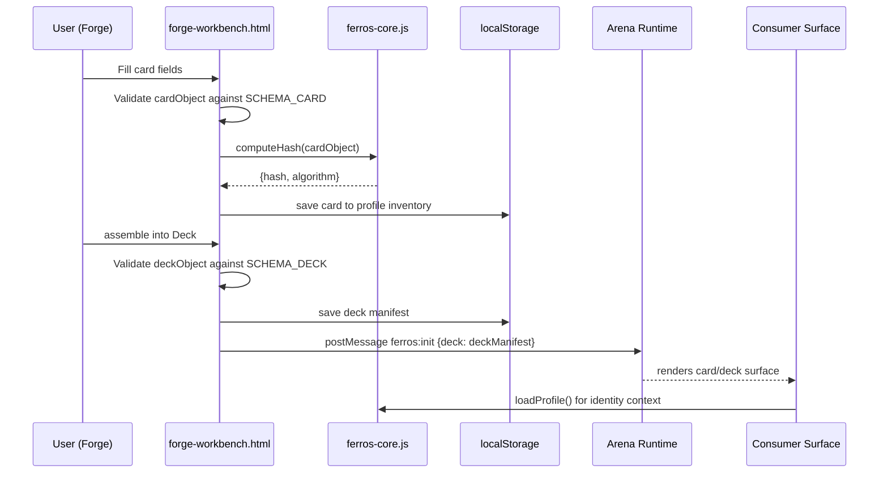

# Stream C — Creative Pipeline (Forge + Arena Runtime)

> **Stream status:** Wave 1 active. Forge and Arena Runtime are early prototypes; card round-trip is the Wave 1 gate.
> **Philosophy:** Without a creative pipeline, there's nothing to trade, battle, or collect. The Forge makes things; the Runtime renders them.

---

## What This Stream Is

Stream C is the content factory. It encompasses two tightly coupled surfaces:

1. **The Forge** (`docs/forge-workbench.html`) — The authoring tool. This is where Cards are created, edited, and assembled into Decks. It's the maker's bench.
2. **Arena Runtime** (the reusable host layer, currently inside `docs/algo-trading-arena.html`) — The rendering engine. This is where Cards and Decks come alive as rendered experiences — a portal, a battle, a loot reveal, a trading card display.

These two live in one stream because they are **producer and consumer of the same schema.** A Card exits the Forge and enters the Runtime. The Forge's output format is the Runtime's input format. If they're in separate streams, they can drift apart. In one stream, they stay synchronized.

---

## Why a Creative Pipeline Matters

FERROS is a platform, not just a profile system. The vision is:
- Players collect Cards
- Players assemble Decks
- Decks are experienced in the Arena
- Cards can be traded, gifted, or sold

None of that is possible without a creative pipeline. The Forge is what makes FERROS generative — you don't just consume assets, you create them. Eventually, agents (Stream B) will be directed to generate Cards via the Forge. For now, humans author them.

The Arena Runtime is the engine that makes assets *experiential*. A Card in a JSON file is data. A Card in the Runtime is an experience — animated, interactive, rendered with a lifecycle (`ferros:init`, `ferros:event`, `ferros:update`).

---

## Core Concepts

### The Card

A Card is the atomic FERROS object. Defined by `schemas/card.schema.json`. A Card has:
- An identity (`id`, `kind`, `name`, `version`)
- A render reference (`renderFile`) and semantic role (`role`)
- Attribution (`attribution.createdBy`, `attribution.linkedTo`) that ties it back to identity context
- Interactive view state (`state`) and spatial transform (`transform`)
- Extension data under `metadata` for card-type-specific fields such as stats, art, or gameplay parameters

Cards are **parametric** — their properties are defined by fields, not hardcoded. The Forge edits those fields; the Runtime renders them.

### The Deck

A Deck is a composed collection of Cards. Defined by `schemas/deck.schema.json`. A Deck has:
- An identity (`id`, `kind`, `name`, `version`)
- A card list (`cards[]`) made of `cardReference` objects
- Optional attribution and render state (`attribution`, `renderFile`, `defaultState`, `states`)
- Optional composition metadata in the deck object itself (`role`, `description`, `tags`)

Decks are the unit of play. The Battle Arena doesn't load individual Cards — it loads Decks. The Forge's final output when building a playable set is a Deck manifest.

### The Bag

The Bag is the local catalog — the user's inventory of Cards and Decks. It's not a schema object; it's the in-memory/localStorage aggregation of all Cards the profile owns. The Forge's left panel is the Bag browser.

### The Runtime

The Arena Runtime is the iframe-based rendering container. It receives Cards and Decks via the `ferros:init` / `ferros:event` / `ferros:update` message protocol defined in C8 (Runtime Host Contract). The host page sends data in; the runtime renders it.

---

## Asset Creation Workflow

```mermaid
flowchart LR
    T["Template\nschemas/template.schema.json"]
    F["Forge\nforge-workbench.html"]
    C["Card object\nschemas/card.schema.json"]
    D["Deck object\nschemas/deck.schema.json"]
    B["Bag\n(local inventory)"]
    R["Arena Runtime\nrendering host"]
    CS["Consumer Surfaces\nStream D"]

    T -->|"card archetype"| F
    F -->|"create/edit"| C
    C -->|"validate + save"| B
    B -->|"assemble"| D
    D -->|"export"| R
    R -->|"ferros:init + ferros:event"| CS
```

### Step by Step

**1. Start from a template archetype**

The Forge opens a template from `docs/assets/_core/templates.json` — the same templates used by Stream B Profile creation. A template archetype for a card type defines the starting schema shape. This keeps cards and profiles on the same schema lineage (C3).

**2. Author the Card**

The Forge presents editable fields matching `schemas/card.schema.json`. The user fills in:
- `name` — display name
- `role` — semantic role for the card inside the system
- `renderFile` — which HTML surface renders this card
- `tags` — discovery / grouping labels
- `metadata.type`, `metadata.stats`, `metadata.art` — card-type-specific parameters stored in the schema's extension field
- `attribution.linkedTo` — pre-filled from the loaded profile context (Stream B)

**3. Validate**

On save, the Forge validates `cardObject` against `schemas/card.schema.json`. H1 already proves the schema against golden fixtures; Forge-side validation must follow that same schema truth and may not invent fields outside the published contract.

**4. Save to Bag**

A valid Card is saved into the profile-owned bag/inventory model. Integrity metadata can be derived via `FerrosCore.computeHash()` without changing the card schema itself.

**5. Assemble a Deck**

From the Bag, the user selects Cards and assembles them into a Deck. The Deck manifest stores `cards[]` as `cardReference` objects, with `cardId` required and `slot`, `group`, `instanceOf`, and `transform` available when needed. Deck validation runs against `schemas/deck.schema.json`.

**6. Export to Runtime**

The Deck manifest is sent to the Arena Runtime via the `ferros:init` message. The Runtime renders the Deck according to its mode (battle, viewer, showcase, etc.).

---

## How Cards Flow from Forge to Runtime to Consumers

---

## Schema Validation at Each Step

Every step in the pipeline validates against the frozen Schema A contracts:

| Step | Schema Checked | Method |
|------|---------------|--------|
| Card creation | `schemas/card.schema.json` (C4) | H1 (harness), plus Forge-owned schema validation against the published contract |
| Deck assembly | `schemas/deck.schema.json` (C5) | H1 (harness), plus Forge-owned schema validation against the published contract |
| Card export | Wave 1 contract decision pending | Current public `FerrosCore.serializeExport()` is profile-only (C9) |
| Runtime init | C8 Runtime Host Contract | H3 (harness), `ferros:init` message shape |
| Fixture corpus | All schemas (C1–C7) | H1 gate harness |

**Golden fixtures for this stream:**

| Fixture | Schema | Purpose |
|---------|--------|---------|
| `schemas/fixtures/card-deck-roundtrip.json` | C5, C9 | Proves deck export/import is clean |
| `schemas/fixtures/deck-card-assembly-seam.json` | C4, C5 | Proves card→deck linkage |

---

## Wave Structure

### Wave 1 — Vertical Slice

The Wave 1 goal: prove that one Card can go from Forge to Runtime and back.

| Step | Capability | Gate |
|------|-----------|------|
| 1 | Card loads in Forge, is editable, renders in Runtime | V5 |
| 2 | Runtime init/update/event loop completes | V6 |
| 3 | Card round-trip export/import preserves all parameters | V7 |

**V5 in detail:** A pre-existing card fixture (`deck-card-assembly-seam.json`) loads in the Forge inspector. The user can see and edit the card fields. The card is sent to the Arena Runtime, which renders it in a portal view. This is the minimum viable creative pipeline.

**V6 in detail:** The Arena Runtime runs the full lifecycle — `ferros:init` (receives card data and nonce), `ferros:update` (receives a state update), `ferros:event` (receives user interaction). H3 harness verifies this contract. Nonce echo is confirmed (PR 5).

**V7 in detail:** A card/deck payload is exported from the Forge, the browser is cleared, and the same payload is imported back. All schema fields are identical — including `id`, `version`, `attribution`, `metadata`, and the `cardReference` structure. This proves Cards are portable, not just viewable.

### Wave 2 — Deck Consumption

| Step | Capability | Gate |
|------|-----------|------|
| 1 | Battle Arena consumes Arena Runtime via contract | S2 |
| 2 | Deck manifest consumed without custom data paths | S2 |

**S2 in detail:** The Battle Arena (Stream D) loads a Deck manifest and sends it to the Arena Runtime via the published contract. No custom message shapes, no bespoke APIs. If the Runtime contract says `ferros:init` takes a `deck` field, that's the only way to send a deck.

### Wave 3 — Pipeline Integration

| Step | Capability | Description |
|------|-----------|-------------|
| 1 | Forge exports to Runtime | Direct Forge → Runtime workflow |
| 2 | Agent-generated cards | Agent Command Center (Stream B) directs card generation in Forge |
| 3 | Card attribution chain | Cards carry creator/owner linkage in `attribution` sourced from identity context |

---

## Entry / Exit Criteria Per Wave

### Wave 1 Entry
- Stream A schemas frozen ✅ (C4, C5 card/deck schemas available)
- `docs/assets/cards/trading-card.html` conforming to C8 (Runtime Host Contract) ✅

### Wave 1 Exit
- V5: Card in Forge → editable → renders in Runtime ✅
- V6: Runtime init/update/event loop via H3 harness ✅
- V7: Card round-trip: export → clear → import → all parameters preserved ✅

### Wave 2 Entry
- Wave 1 exit ✅
- Stream D Battle Arena surface ready to consume (coordination with Stream D Wave 2)

### Wave 2 Exit
- S2: Battle Arena consumes Arena Runtime without custom data paths ✅
- At least one golden deck fixture consumed by the Runtime

---

## The Runtime Host Contract (C8)

The Arena Runtime implements the `ferros:init` / `ferros:event` / `ferros:error` protocol defined in `docs/contracts/runtime-host-v1.md`. Every surface that embeds the Runtime must use this protocol.

**Why a contract for a message protocol?**

Because the Runtime is meant to be *reusable*. The Battle Arena, a loot box reveal, a card showcase, a reward animation — these are all different experiences, but they all run on the same Runtime container. The contract is what makes the Runtime pluggable rather than a one-off iframe.

The contract specifies:
- `ferros:init` — initial data + nonce. The runtime echoes the nonce in all outbound messages (provenance proof).
- `ferros:event` — user interaction events with attribution
- `ferros:update` — state change push from host
- `ferros:error` — runtime signals an error to the host

The nonce echo (fixed in PR 5) is the key security property: the host can verify that an outbound message came from *its* runtime instance, not from another iframe that was injected.

---

## Forge Current State and Immediate Work

Current state: `docs/forge-workbench.html` is an early prototype showing the four-corner docking layout (ADR-009) and basic Bag/inspector regions. No card creation workflow exists yet.

**Immediate Wave 1 work to unlock V5:**

1. Load a card fixture from `schemas/fixtures/deck-card-assembly-seam.json` into the Forge inspector
2. Render the card fields as editable inputs, bound to `schemas/card.schema.json`
3. Wire the "Preview in Runtime" button to send `ferros:init` to the Runtime iframe
4. Wire `FerrosCore.validateImport()` on save
5. Wire `FerrosCore.computeHash()` for seal chain entry on first save

This is targeted, concrete work that can be assigned to an agent immediately with no Stream A dependencies outstanding.

---

## Legacy Integration Items for Stream C

Per ADR-013, legacy patterns from predecessor repos are activated wave-by-wave:

| ID | Pattern | Target | Status |
|----|---------|--------|--------|
| L5 | Template engine for Forge card authoring (`botgen-rust template_engine.rs`) | Wave 1 Track B | ⬜ Not yet activated |
| L6 | Dependency graph for Card→Template chains (`sheetgen-rust dependencies.rs`) | Wave 1 Track B | ⬜ Not yet activated |

These are activated when Wave 1 entry criteria are met and the Forge begins real card authoring.

---

## Key Artifacts Produced by Stream C

| Artifact | Schema | Consumer |
|---------|--------|----------|
| Card objects | `schemas/card.schema.json` | Stream D (Battle Arena, Trading) |
| Deck manifests | `schemas/deck.schema.json` | Stream D (Battle Arena) |
| Card fixtures (golden) | C4 | Stream A harnesses (H1), Stream E conformance |
| Deck fixtures (golden) | C5 | Stream A harnesses (H1), Stream E conformance |
| Arena Runtime (rendered surfaces) | C8 | Stream D (all consumer surfaces) |

---

## Philosophy: Why Separate Forge from Runtime?

A common pattern in game platforms is to build the editor and the player as one system. FERROS deliberately separates them because:

**The Forge is a creator tool.** It needs inspector panels, undo/redo, field validation UI, side-by-side comparison, and batch operations. These are authoring affordances that have nothing to do with playing a card.

**The Runtime is a player.** It needs animation loops, event handlers, deterministic rendering, and low latency. These are performance requirements that have nothing to do with editing a field.

Mixing them would mean every performance optimization in the Runtime adds complexity to the Forge, and every UX improvement in the Forge risks breaking the Runtime's rendering contract. Separation is the right choice.

The contract between them (`ferros:init` message format) is the seam. Keep the seam clean and the two tools can evolve independently.
