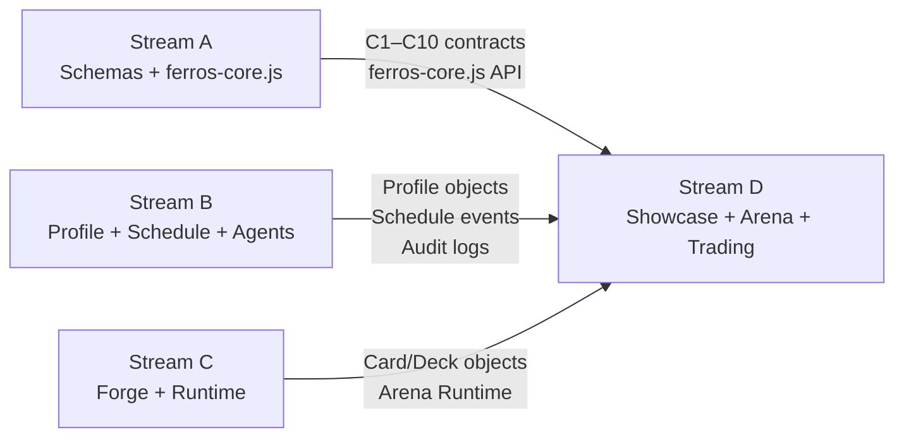

# Stream D — Consumer Surfaces (Showcase, Battle Arena, Trading)

> **Stream status:** Wave 2 entry blocked until V1–V8 (Stream B) and S2 (Stream C) complete. Scaffolding can begin now.
> **Philosophy:** Consumers prove the system works. They don't create data — they read it, render it, and demonstrate that the contracts are real.

---

## What This Stream Is

Stream D contains every surface that **consumes** assets and contracts from Streams A, B, and C without creating its own data paths. These are the user-facing surfaces that prove FERROS is a working platform, not just a collection of specs and fixtures.

The three surfaces in Stream D:

1. **Showcase / Landing Page** (`docs/ferros-showcase.html`) — The public face of FERROS. Reads real capability gate status from `docs/contracts/manifest.json` and displays it to the world.
2. **Battle Arena** (`docs/algo-trading-arena.html`) — The game layer. A battle game built on top of the Arena Runtime (Stream C). Consumes Deck manifests, renders card battles, links to profile progression.
3. **Trading** — The exchange layer. Profile-linked card trading using the same portable profile token from Stream B. Uses the same card schema from Stream C.

---

## What "Consumer" Means

A consumer surface follows three rules:

**Rule 1: No custom data paths.** If a consumer needs profile data, it calls `FerrosCore.loadProfile()`. It does not invent its own localStorage keys or its own identity format.

**Rule 2: No private schemas.** If a consumer needs to send a card to the Runtime, it uses the card schema from Stream A and the message format from C8. It does not invent a bespoke card shape.

**Rule 3: No bespoke storage.** If a consumer writes data, it writes to the profile object via `FerrosCore.saveProfile()` or appends to the audit log via `FerrosCore.pushAuditEntry()`. It does not create its own tables.

**Why these rules?** Because the whole point of the stream model is that consumer surfaces *prove the contracts are real*. If a consumer invents its own schema, it proves nothing about the shared contract. The power of the consumer constraint is that when Showcase, Battle Arena, and Trading all work using only the published contracts, you have proof that the contracts are sufficient for real use cases.

---

## The Three Consumer Surfaces

### 1. Showcase / Landing Page

**File:** `docs/ferros-showcase.html`  
**Purpose:** Explain FERROS to the world. Show the real capability gate status.  
**Wave 2 gate:** S3 — Showcase reads real capability status, not illustrative placeholders.

**Current state:** Prototype exists. Contains illustrative progress bars that are not connected to `manifest.json`. These must be replaced with live status reads.

**What S3 requires:**

1. Showcase reads `docs/contracts/manifest.json` at page load
2. For each contract C1–C10, it displays the manifest's current `status` together with the contract name and evidence links already present in the manifest
3. The display is not hardcoded — it reflects the actual manifest state
4. If a contract status changes in the manifest, the Showcase updates automatically

**Why this is the right gate for Wave 2:**

S3 is a simple technical requirement with a profound implication. If the Showcase reads live status from the manifest, then the manifest is real infrastructure, not documentation theater. The manifest is the source of truth; the Showcase is the mirror. When the mirror is live, the source is proven.

**The Showcase is also the onboarding gateway.** A new person who wants to understand FERROS opens the Showcase. If the Showcase accurately represents the project state — including what's done and what's not — it builds trust. Illustrative placeholders erode trust.

**Data consumed from other streams:**
- `docs/contracts/manifest.json` (Stream A) — contract status
- `docs/assets/_core/ferros-core.js` (Stream A) — `FerrosCore` API for loading profile if logged in
- Profile data (Stream B) — if a profile is loaded, Showcase can personalize the view
- Card examples (Stream C) — rendered card previews in the showcase

---

### 2. Battle Arena

**File:** `docs/algo-trading-arena.html`  
**Purpose:** A card battle game built on the Arena Runtime. Proves the Runtime can serve a game surface.  
**Wave 2 gate:** S2 — Battle Arena consumes Arena Runtime without custom data paths.

**Current state:** Prototype exists but the Arena Runtime and Battle Arena game logic are mixed together. Stream C Wave 1 will separate the Runtime layer. Stream D Wave 2 will then build the Battle Arena on top of that separated Runtime.

**What S2 requires:**

1. The Battle Arena loads a Deck manifest (produced by Stream C Forge)
2. It sends the deck to the Arena Runtime via `ferros:init` message
3. Battle state, card renders, and interactions flow through `ferros:event` / `ferros:update`
4. No custom message shapes — only the C8 Runtime Host Contract

**The game loop:**

```
Load profile (FerrosCore.loadProfile())
  → Load deck from profile's card inventory
  → Send deck to Arena Runtime via ferros:init
  → Arena Runtime renders cards
  → User actions → ferros:event messages
  → Runtime updates → ferros:update messages
  → Battle result → audit record via FerrosCore.pushAuditEntry()
  → XP + progression update → FerrosCore.saveProfile()
```

**Why via the Runtime contract?** Because the Battle Arena is not special. The same Runtime that renders a card battle should be able to render a trading card display or a loot box reveal. The Runtime is the general-purpose container; the Battle Arena is one application of it. Proving S2 proves the Runtime is general.

**Data consumed from other streams:**
- Profile + session state (Stream B) — player identity, XP, progression
- Deck manifests, Card objects (Stream C) — the assets to battle with
- Arena Runtime (Stream C) — the rendering container
- Audit record schema (Stream A) — for logging battle results

---

### 3. Trading

**File:** TBD — currently conceptual. Will build on the profile portability from Stream B.  
**Purpose:** Card trading between profiles. Proves the portability model works for exchanges.  
**Target wave:** Wave 3+ (after S4 — contracts frozen at v1).

**The trading philosophy:**

Trading in FERROS is the same mechanism as profile portability. When two players trade cards:

1. Player A has a card in their profile inventory
2. Player A exports the card (same as exporting a profile token)
3. Player B validates the card or deck payload against `schemas/card.schema.json` / `schemas/deck.schema.json`, plus any attached provenance envelope
4. Player B's profile takes ownership by accepting the asset into the profile bag and updating `attribution.linkedTo`, not by mutating a private `profileId` field
5. An audit record logs the transfer on both sides

This is not a blockchain. There's no distributed ledger. It's two local-first profiles exchanging a JSON object with schema validation and seal chain provenance. Simple, verifiable, offline-capable.

**The portability metaphor:** Cards trade between players the same way profiles trade with websites. The unit of exchange is a validated, sealed JSON object. The trust model is the schema + seal chain, not a server.

**Data consumed from other streams:**
- Profile objects (Stream B) — both sides of the trade
- Card objects (Stream C) — what's being traded
- Storage rules (Stream A) — how ownership transfer is recorded
- Permission model (Stream A) — consent for the transfer

---

## Wave Structure

### Wave 2 — First Consumers

Stream D's entry condition: V1–V8 from Stream B complete, plus S2 requires V5–V7 from Stream C.

| Capability | Surface | Entry | Exit |
|-----------|---------|-------|------|
| S2 | Battle Arena consumes Runtime | Stream C V5–V7 ✅ | Battle Arena runs via contract |
| S3 | Showcase reads live manifest | Stream B V1 ✅ | Showcase shows real gate status |
| S4 | Shared contracts frozen at v1 | S2 + S3 done | All surfaces working on v1 contracts |

**S4 Philosophy:** Freezing contracts at v1 for local-first use means: every surface in every stream agrees on the published version markers already in the contracts, such as `profile.meta.version = "1.0"` and `card.version >= 1`. From this point on, any schema change requires a migration rule. This is the stability guarantee that lets external developers build on FERROS with confidence.

### Wave 3 — Permissioned Actions and Trading

| Capability | Surface | Entry | Exit |
|-----------|---------|-------|------|
| Trading surface | Trading | S4 done | One end-to-end card trade completes |
| Identity/consent cross-surface | All D surfaces | P1 done (Stream B) | Consent enforced on ≥2 consumer surfaces |

---

## Entry / Exit Criteria

### Wave 2 Entry
- Stream B: V1–V8 complete (profile functional, acceptance harness passes)
- Stream C: V5–V7 complete (card in Forge → Runtime → import/export)
- Stream A: Deferred items resolved (C7 fixture, contract co-location)

### Wave 2 Exit
- S2: Battle Arena consumes Arena Runtime only via C8 contract ✅
- S3: Showcase reads real manifest, zero illustrative placeholders ✅
- S4: Contracts frozen at v1, all surfaces confirmed on frozen versions ✅

---

## Dependencies Map



Stream D has the most dependencies of any stream — it sits at the top of the dependency tree. This is correct: consumer surfaces should be the last to fully implement because they need all the upstream contracts and assets to be real before they can prove anything.

However, **scaffolding can start now.** The Showcase can be wired to read the manifest today. The Battle Arena can be built against golden card/deck fixtures today. These are not blocked — they just need to be written to use the contracts rather than hardcoded data.

---

## What "Proving the System Works" Looks Like

The reason Stream D exists is to answer the question: **Is FERROS real?**

Stream A can produce 10 passing harnesses and it's still a schema project. Stream B can have a beautiful profile UI and it's still a local app. Stream C can render cards in a Runtime and it's still a demo.

When Stream D surfaces work — when the Showcase reads real data, when the Battle Arena runs via the Runtime contract, when a card trades between two profiles — then FERROS is a platform. The contracts are real because they serve real use cases. The portability is real because it was tested in a trade.

This is why consumer surfaces matter and why they must stay as pure consumers. The moment a consumer invents its own data path, it proves nothing about the shared contracts — it proves only that it was easier to hack something together than to use the contracts. That's a failure mode, not a feature.

---

## Harness Strategy for Stream D

Stream D does not have its own gate harnesses in Wave 0 or Wave 1. It uses the shared harness infrastructure from Stream A.

**In Wave 2, Stream D will need:**

| Harness | Purpose | Gate? |
|---------|---------|-------|
| `showcase-acceptance-harness.html` | Verify Showcase reads live manifest | Gate (S3) |
| `battle-arena-contract-harness.html` | Verify Battle Arena uses only C8 for Runtime communication | Gate (S2) |
| `trading-round-trip-harness.html` | Verify card trade preserves all fields and updates profile bag ownership / attribution linkage | Gate (Wave 3) |

These harnesses follow the same pattern as Stream A harnesses: they run in Chrome via `file://`, load `ferros-core.js`, and use binary pass/fail gates.

---

## Stream D and the Fixture Corpus

Stream D surfaces consume the same golden fixtures produced by Streams A, B, and C. They do not create fixtures — they consume them.

This creates a verification chain:
1. Stream A produces `deck-card-assembly-seam.json` — a golden deck fixture
2. Stream C validates it loads correctly in the Runtime (V5)
3. Stream D's Battle Arena loads the same fixture and sends it to the Runtime
4. If the Battle Arena's harness passes, it proves the fixture is consumed correctly end-to-end

The fixture corpus is the shared truth that flows through the entire system.
