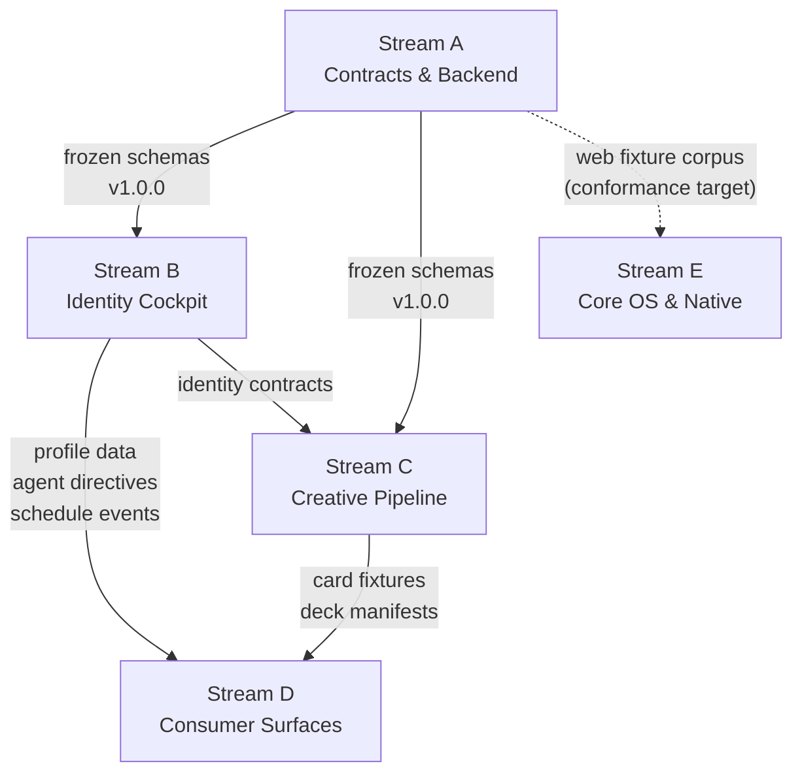
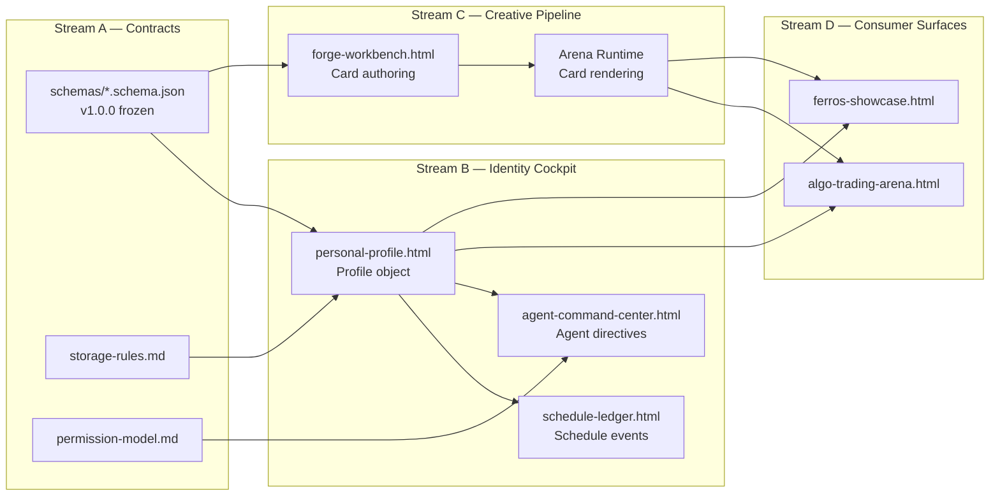

# FERROS Architectural Mindmap — Streams Overview

> This document is the project's architectural mindmap. It maps every FERROS stream, their internal waves, their interconnections, and the philosophy behind each decision. Read it as an instruction manual that also explains *why*.

---

## What is a Stream?

A **stream** is a parallel track of work that can advance independently without blocking other tracks. Streams replace the old sequential model where every wave had to close before the next one could open. Each stream has its own internal wave structure, entry/exit criteria, and dependency contracts.

**The rule:** Streams depend on each other through *artifacts and contracts*, not through *timeline locks*. Stream B can proceed as soon as Stream A publishes a frozen schema — it does not need to wait for Stream A to reach 100%.

---

## Stream Map

```
Stream A — Contracts & Backend Infrastructure
  │  (publishes: frozen schemas, storage rules, permission model)
  ▼
Stream B — Identity Cockpit (Profile + Ledger + Agent Center)
  │  (publishes: profile fixtures, agent directives, schedule events)
  ▼
Stream C — Creative Pipeline (Forge + Arena Runtime)
  │  (publishes: card fixtures, deck manifests, rendered surfaces)
  ▼
Stream D — Consumer Surfaces (Showcase, Battle Arena, Trading)

Stream E — Core OS & Native Rendering  [independent research track]
```

---

## The Five Streams

| Stream | Name | Current Wave | Blocked By |
|--------|------|-------------|------------|
| A | Contract & Backend Infrastructure | Wave 1 (hardening) | Nothing — Wave 0 CLOSED |
| B | Identity Cockpit | Wave 1 (vertical slice) | Stream A schemas (frozen ✅) |
| C | Creative Pipeline | Wave 1 (vertical slice) | Stream A schemas (frozen ✅) |
| D | Consumer Surfaces | Wave 2 (first consumers) | Stream B profile data, Stream C card assets |
| E | Core OS & Native Rendering | Research (parallel) | Nothing |

---

## Stream Dependency Graph



---

## Data Flow: How Information Moves Between Streams



---

## Stream A — Contract & Backend Infrastructure

**Purpose:** Be the bedrock. Every other stream builds on contracts defined here. Nothing that builds on a foundation should have to worry about that foundation shifting.

**Philosophy:** Contracts-first means the schema is the truth. If the schema says a field is required, every surface must supply it. If the schema says a field is forbidden, no surface may add it. Binary gates, not percentages — a contract either passes or it doesn't.

**Wave structure:**

| Wave | Goal | Entry | Exit |
|------|------|-------|------|
| 0 | Contract spine | Now | C1–C10 all pass ✅ **CLOSED** |
| 1 | Hardening & deferred items | Wave 0 closed | Deferred items resolved or versioned |
| 2+ | Schema evolution | Wave 1 closed | Migration rules proven (H1) |

**Key artifacts produced:**
- `schemas/*.schema.json` (7 schemas, all versioned)
- `schemas/fixtures/` (19 fixtures: 13 golden + 6 negative)
- `docs/contracts/manifest.json`
- `docs/contracts/storage-rules.md`
- `docs/contracts/permission-model.md`
- `docs/contracts/runtime-host-v1.md`
- `docs/assets/_core/ferros-core.js`

**Provides to other streams:** The entire contract surface. Schemas, harnesses, the `FerrosCore` API, and the fixture corpus are the shared language of the project.

---

## Stream B — Identity Cockpit (Profile + Ledger + Agent Center)

**Purpose:** The CEO's desk. One person's identity, schedule, and agent delegation layer — three surfaces that work together harmoniously as a single stream.

**Philosophy:** These three surfaces are unified because they represent the complete picture of one person operating the FERROS platform:
- **Personal Profile** is who you are — your identity, your data, your portability token
- **Schedule Ledger** is what you're doing — your calendar, your commitments, your days
- **Agent Command Center** is who you're directing — the bots, the audit trail, the delegation layer

They are not separate apps. They are three facets of the same cockpit.

**Wave structure:**

| Wave | Goal | Entry | Exit |
|------|------|-------|------|
| 1a | Profile shell functional | Stream A schemas frozen | Template → Profile creation completes (V1) |
| 1b | Export/import proven | V1 complete | Export → Import round-trip identical (V2) |
| 1c | Session modes proven | V2 complete | All 4 session modes work (V3a + V3b) |
| 2a | Ledger consumes profile | V3 complete | Schedule Ledger reads profile data (S1) |
| 2b | Agent center logs directives | S1 complete | Agent directives logged with audit trail (P1 precursor) |
| 3 | Agent actions wired | P1 | One agent action executes (P1) |

**Key artifacts produced:**
- Profile objects conforming to `schemas/profile.schema.json`
- Schedule events conforming to `schemas/schedule-event.schema.json`
- Agent directive log entries conforming to `schemas/audit-record.schema.json`
- Export envelopes (portability tokens)

**Provides to other streams:** Profile identity data used by Stream C and D. Schedule events consumed by Stream D surfaces.

---

## Stream C — Creative Pipeline (Forge + Arena Runtime)

**Purpose:** The content factory. Cards and Decks are created in the Forge and rendered/consumed in the Arena Runtime. This stream is what makes FERROS a platform rather than just a profile system.

**Philosophy:** Without a creative pipeline, there's nothing to trade, nothing to battle, nothing to collect. The Forge is the authoring tool; the Arena Runtime is the rendering engine. They are producer and consumer of the same Card/Deck schema, which is why they live in one stream.

**Wave structure:**

| Wave | Goal | Entry | Exit |
|------|------|-------|------|
| 1a | Card round-trip | Stream A schemas frozen | Card loads in Forge → renders in Runtime (V5) |
| 1b | Runtime loop | V5 complete | init/update/event loop completes (V6) |
| 1c | Card portability | V6 complete | Card round-trip export/import (V7) |
| 2 | Deck assembly | V7 complete | Deck consumed by Battle Arena (S2) |
| 3 | Forge → Runtime pipeline | S2 complete | Forge exports directly to Arena Runtime |

**Key artifacts produced:**
- Card objects conforming to `schemas/card.schema.json`
- Deck objects conforming to `schemas/deck.schema.json`
- Rendered surfaces hosting cards/decks
- Golden card/deck fixtures

**Provides to other streams:** Card and deck fixtures for Stream D surfaces. The Arena Runtime that Stream D's Battle Arena builds on.

---

## Stream D — Consumer Surfaces (Showcase, Battle Arena, Trading)

**Purpose:** Prove the system works for real users. Consumer surfaces read contracts and render assets — they don't create them. If Streams A, B, and C are the factory floor, Stream D is the showroom.

**Philosophy:** "Consumer" means: no custom data paths, no private schemas, no bespoke storage. Stream D surfaces read only from published contracts (Stream A), profile/identity data (Stream B), and card/deck assets (Stream C). This constraint proves the system is real and not just a demo.

**Wave structure:**

| Wave | Goal | Entry | Exit |
|------|------|-------|------|
| 2a | Showcase reads real status | V1–V8 done | Showcase shows live capability gates (S3) |
| 2b | Battle Arena consumes Runtime | S2 done | Arena works via Runtime contract (S2) |
| 2c | Shared contracts frozen | S2 done | Contracts at v1 for local-first use (S4) |
| 3 | Trading surface | S4 done | Profile-linked card trading flow |

**Key artifacts produced:**
- Live capability status feeds
- Battle game built on Arena Runtime
- Trading interface using profile portability

**Depends on:** Stream A (contract truth), Stream B (profile/identity data), Stream C (card/deck assets).

---

## Stream E — Core OS & Native Rendering

**Purpose:** The long game. FERROS is not just a website — it's an operating system. This stream proves the native path exists and that the web fixture corpus will translate to native rendering.

**Philosophy:** Independence is a feature. A FERROS profile that lives only in a browser is fragile. The Core OS track ensures there's a path from `ferros-blueprint.html` → native rendering → hardware boot. It runs parallel to all other streams because it doesn't block anything and nothing blocks it.

**Wave structure:**

| Wave | Goal | Entry | Exit |
|------|------|-------|------|
| R1 | Renderer conformance suite | Anytime | Golden fixture corpus renders correctly in web |
| R2 | QEMU bring-up | R1 | QEMU boots to a FERROS surface |
| R3 | Native/web parity | R2 | Native output matches web fixture corpus |

**Key artifacts produced:**
- QEMU boot image
- Conformance suite results
- Evidence of web/native rendering parity

**Independent track:** No dependency on Streams A–D for progress. However, the web fixture corpus from Stream A is the conformance target.

---

## Interconnection Map

### What Each Stream Provides and Consumes

| Stream | Provides | Consumes |
|--------|----------|----------|
| A | Schemas, contracts, `ferros-core.js`, fixture corpus | Nothing upstream |
| B | Profile objects, schedule events, agent audit logs | Stream A schemas |
| C | Card objects, deck objects, rendered surfaces | Stream A schemas, Stream B identity |
| D | Live capability status, battle game, trading UI | Stream A contracts, Stream B profiles, Stream C cards/decks |
| E | Boot image, conformance results | Stream A fixture corpus (as conformance target) |

### Shared Contracts and Who Calls What

`ferros-core.js` is the shared runtime core. It exposes the `window.FerrosCore` API. Every surface that needs to read/write profile data, validate schemas, or handle sessions goes through this API.

| API Method | Called By | Purpose |
|------------|-----------|---------|
| `FerrosCore.validateImport()` | Profile, Forge, all importers | Schema validation on import |
| `FerrosCore.serializeExport()` | Profile export, card export | Portable export envelope |
| `FerrosCore.saveProfile()` | Personal Profile | Durable write with quota guard |
| `FerrosCore.canMutateDurableState()` | All surfaces | Permission gate for writes |
| `FerrosCore.templateToEvents()` | Schedule Ledger | Convert template → schedule events |
| `FerrosCore.pushAuditEntry()` | Agent Command Center, all write paths | Append audit record (FIFO ring, cap 1000) |
| `FerrosCore.computeHash()` | Seal chain, export | `{hash, algorithm}` for seal integrity |

### How the Fixture Corpus Flows

```
Stream A produces:
  schemas/fixtures/*.json (19 fixtures)
         │
         ├──→ H1–H4 gate harnesses (Stream A testing)
         ├──→ Stream B surfaces (profile/identity fixtures as test data)
         ├──→ Stream C surfaces (card/deck fixtures as test data)
         └──→ Stream E conformance suite (web rendering baseline)
```

---

## Completeness Checklist — Capability to Stream Mapping

Every capability from PROGRESS.md maps to exactly one stream.

### Tier 1 — Contracts (Wave 0) → Stream A

| ID | Capability | Stream | Status |
|----|-----------|--------|--------|
| C1 | Identity/session schema versioned with fixtures | A | ✅ |
| C2 | Profile schema versioned with fixtures | A | ✅ |
| C3 | Template schema versioned with fixtures | A | ✅ |
| C4 | Card schema versioned with fixtures | A | ✅ |
| C5 | Deck schema versioned with fixtures | A | ✅ |
| C6 | Schedule event schema versioned with fixtures | A | ✅ |
| C7 | Audit record schema versioned with fixtures | A | ✅ |
| C8 | Runtime host contract v1 | A | ✅ |
| C9 | Storage rules | A | ✅ |
| C10 | Permission model skeleton | A | ✅ |

### Tier 2 — Vertical Slice (Wave 1) → Streams B and C

| ID | Capability | Stream | Status |
|----|-----------|--------|--------|
| V1 | Template → Profile creation | B | 🔧 built, pending run |
| V2 | Export → Import round-trip | B | ⬜ |
| V3a | All 4 session modes | B | 🔧 built, pending run |
| V3b | Invalid session mode rejection | B | 🔧 built, pending run |
| V4 | Alias session → export → claim → XP merge | B | ⬜ |
| V5 | Card loads in Forge → renders in Runtime | C | ⬜ |
| V6 | Runtime init/update/event loop | C | ⬜ |
| V7 | Card round-trip export/import | C | ⬜ |
| V8 | Phase 0 acceptance harness (H5) | B | 🔧 built, pending run |

### Tier 3 — First Consumers (Wave 2) → Streams B, C, D

| ID | Capability | Stream | Status |
|----|-----------|--------|--------|
| S1 | Schedule Ledger reads profile/template data | B | ⬜ |
| S2 | Battle Arena consumes Arena Runtime | D (via C) | ⬜ |
| S3 | Showcase reads real capability status | D | ⬜ |
| S4 | Shared contracts frozen at v1 | A | ⬜ |

### Tier 4 — Permissioned Actions (Wave 3) → Stream B

| ID | Capability | Stream | Status |
|----|-----------|--------|--------|
| P1 | One agent-triggered action flow with audit trail | B | ⬜ |
| P2 | Identity/consent enforced across ≥2 surfaces | B (enforced via A) | ⬜ |
| P3 | Action contract versioned and tested | B | ⬜ |

### Tier 5 — Hardening (Wave 4) → Stream A

| ID | Capability | Stream | Status |
|----|-----------|--------|--------|
| H1 | Schema migration rules tested | A | ⬜ |
| H2 | Cross-browser support validated | A | ⬜ |
| H3 | Import/export corruption handling | A/B | ⬜ |
| H4 | Accessibility baseline | All (cross-cutting) | ⬜ |
| H5 | Performance budgets defined and met | All (cross-cutting) | ⬜ |
| H6 | Public docs match shipped behavior | A | ✅ (Wave 0 scope) |

### Separate Track — Core OS → Stream E

| ID | Capability | Stream | Status |
|----|-----------|--------|--------|
| R1 | Renderer conformance suite | E | ⬜ |
| R2 | QEMU bring-up proven | E | ⬜ |
| R3 | Native rendering vs web fixture corpus | E | ⬜ |

### Legacy Integration → Mapped to Streams

| ID | Pattern | Target Stream | Target Wave | Status |
|----|---------|--------------|------------|--------|
| L1 | Harness drift detection | A | Wave 0 | ⬜ |
| L2 | Agent trait spec for C8 | B | Wave 3 | ⬜ |
| L3 | Command bus architecture for C7 | B | Wave 3 | ⬜ |
| L4 | Three-layer decomposition | A (architecture) | Wave 1 | ⬜ |
| L5 | Template engine for Forge | C | Wave 1 | ⬜ |
| L6 | Dependency graph for Card→Template | C | Wave 1 | ⬜ |
| L7 | Work queue for Schedule Ledger | B | Wave 2 | ⬜ |
| L8 | Voting/ranking for Arena | D | Wave 2 | ⬜ |
| L9 | Full agent system + routing | B | Wave 3 | ⬜ |
| L10 | WASM contract validators | A | Research | ⬜ |

---

## Gap Analysis

### Capabilities With No Stream (Gaps)

*None identified.* Every capability from PROGRESS.md maps to at least one stream. H4 (accessibility) and H5 (performance) are cross-cutting hardening items owned by Stream A in coordination with all surface streams.

### Capabilities Claimed by Multiple Streams (Overlaps)

| Capability | Streams | Resolution |
|-----------|---------|------------|
| H3 — Import/export corruption | A + B | A owns the storage contract; B owns the profile surface that implements it. Not a conflict — A defines the rule, B enforces it on its surfaces. |
| H4 — Accessibility | All streams | Each stream owns accessibility within its own surfaces. Stream A documents the baseline requirement. |
| H5 — Performance | All streams | Same as H4 — per-surface ownership, A documents the budget standard. |
| S4 — Contracts frozen | A + All | A freezes them; all streams consume them. A is the canonical owner. |

---

## Harness Strategy

All harnesses run in Chrome via `file://`. They load `ferros-core.js` from `docs/assets/_core/ferros-core.js`.

| Stream | Harnesses | Gate vs Supporting |
|--------|-----------|-------------------|
| A | H1–H4, H6–H8, Preflight | H1–H4 are gates; H5–H8 are supporting |
| B | H5 (acceptance), H6 (write-path), H8 (UI acceptance) | Supporting in Wave 0; gate in Wave 1 (V8) |
| C | H3 (runtime harness), future Forge harness | H3 is an A-stream gate; Forge harness is C-stream future work |
| D | Future consumer harnesses | TBD in Wave 2 |
| E | Conformance suite (future) | TBD in research track |

---

## Freeze Policy

> **Wave 0 is FROZEN as of PR #47.** Any new audit finding against Wave 0 contracts goes to the backlog — not to a Wave 0 reopener.

The rule: once a wave closes, it stays closed. New findings become Wave N+1 items or stream-specific backlog items. This is how we stop the "audit → reopen → audit" cycle that was blocking all other progress.

Schema versioning follows semantic versioning:
- `1.0.0` — current frozen baseline
- `1.x.0` — backward-compatible additions (new optional fields)
- `2.0.0` — breaking changes (require migration rules per ADR-012)
